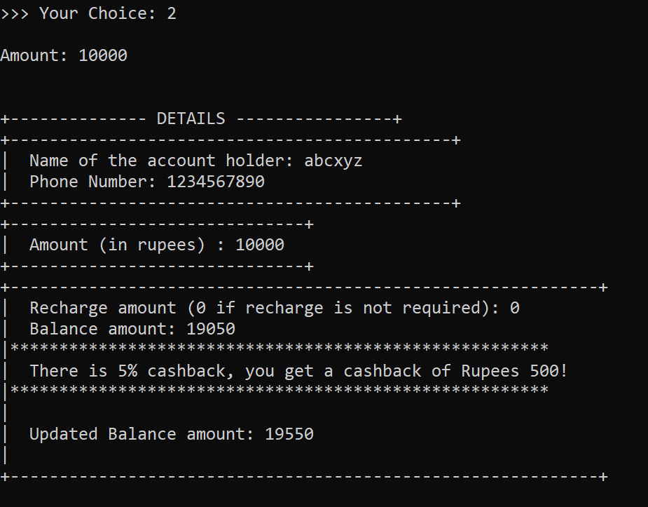

# CommandLinePaytm


### *Contents*

- [Introduction](#introduction)
- [Class Diagram](#class-diagram)
- [Demonstration](#demonstration)
- [Final Overview](#final-overview)
- [Setup](#setup)
- [Authors](#authors)

#### *Introduction*

- PaytmLite has utilities that are somewhat similar to that of paytm. Paytm
  offers services such as online use-cases like mobile recharges, utility bill
  payments and events bookings as well as in-store payments at grocery
  stores, fruits and vegetable shops, restaurants, parking, tolls,
  pharmacies and educational institutions.


## *Class Diagram*


# *Demonstration*

- It accepts input from the command line and displays results there itself.
- The user is first required to input the username and password for their
  paytmLite account. If any one of the credentials from the username or
  password happens to be wrong, it displays the message “Either the
  username or password is incorrect."

Credentials:

```bash
username: admin
password: admin123
```


- The password is **masked** while typing by using the input function of **`console().readPaswword()`** This ensures the *safety* of the password and in turn, the safety of the app data itself. On typing the correct username and password, the user is then directed to the app
  which first asks for the name and phone number of the user.
- The user is then provided a choice of: (1) payment to someone (2) Put in money in
  the paytmLite wallet or (3) Exit.


- Complete Validation is taken care of.


- If the user goes with the first option, then the account name and account number of the person to whom the money is to be paid is asked. Then it asks for the amount that is to be paid. It also gives an option for mobile recharge, which if not needed at the moment, has to be entered as 0, or else if the mobile recharge is required, then the amount is to be mentioned.
- It then *prints out all the details for the convenience of the user*, shows the balance amount in the account which is total-amount paid-recharge and offers cashback feature as well.


- If the amount exceeds the amount in the wallet, the exception is taken care of.


- If the user goes with the second option. It then prints out all the details
  for the convenience of the user, shows the balance amount in the
  account which is Total + amount added-recharge and offers cashback feature as well.
- If the user goes with the third option, then it simply exits the program.




## *Final Overview*

- Our project is based mainly on the concept of inheritance in java.
  Inheritance in Java is a mechanism in which one object acquires all
  the properties and behaviours of a parent object. It is an important
  part of Object Oriented programming system.
- The idea behind inheritance in Java is that you can
  create new classes that are built upon existing classes. When
  you inherit from an existing class, you can reuse methods
  and fields of the parent class. Moreover, you can add
  new methods and fields in your current class also.
- Our project uses **Multilevel inheritance** ,which refers to a
  mechanism where one can inherit from a derived class,
  thereby making this derived class the base class for the new
  class. C is subclass or child class of B and B is a child class of A.

```
Super class : A
Intermediate class : B
Subclass: C
```


## *Setup*

* Download the latest version of Java - [Java SE - Downloads | Oracle](https://www.oracle.com/java/technologies/javase-downloads.html).
* Clone the repository: `git clone https://github.com/tusharnankani/CommandLinePaytm.git`
* Open this directory in Command Promt or Shell.
* Compile the file using the command: `javac paytmLite.java`
* Run the file using the command: `java paytmLite`


### *Authors*

* Kavya Nair
* Parth Namdev
* Tushar Nankani

### License📜

[MIT License](https://github.com/tusharnankani/CommandLinePaytm/blob/main/LICENSE)
